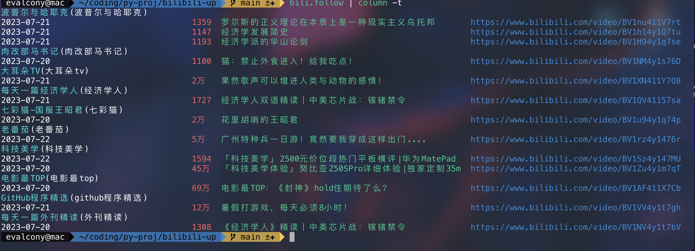
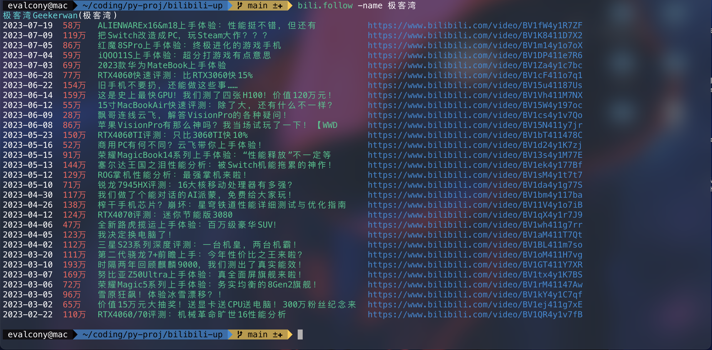
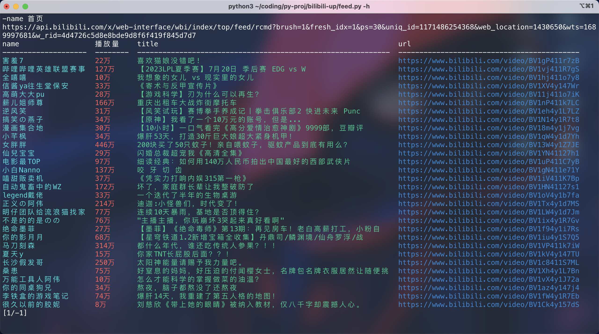
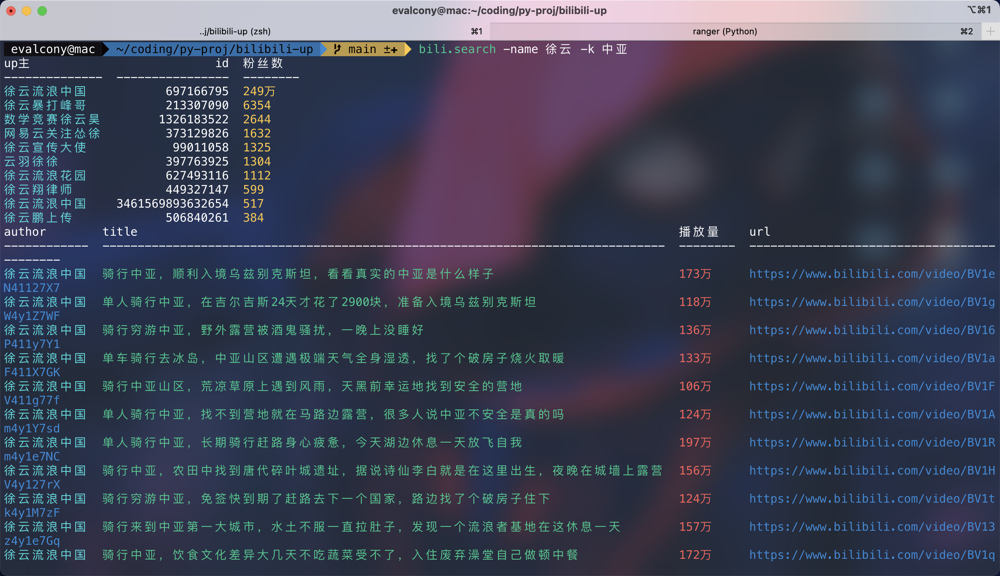

# bilibili up 主更新拉取+feed流数据拉取

# 功能

程序入口
- up.py: 拉取 up 主投稿数据
  - 全选模式（拉取config.ini 中配置的全部人的相关投稿）
  - 个人模式（根据nickname拉取指定up主的投稿） 
- feed.py: 拉取 feed 流，也即首页、各分区页面数据
- search.py: 根据up主名字/up主id、关键字，搜索up主相关投稿

# 使用方法

### up.py

```commandline
python3 up.py -参数
```

- -h: 查看帮助。
- -d: 近d天内的投稿。默认=3。当=-1时表示不限制。
- -n: 每人最多显示投稿条数。默认=3。当=-1时表示不限制。
- -name: 拉取指定nickname up主的投稿。当用此参数时，-d -n 默认为-1
- -a: 标题长度缩略开关。默认开启。长度默认30。
- -l: 查看所有的 nickname

默认数值都配置在config.ini文件中


### feed.py

```commandline
python3 feed.py
```

没有执行参数，而是进入程序体内，根据提示输入参数，控制流程。

### search.py

```commandline
python3 search.py
```

- -h: 查看帮助
- -u: up主名字
- -id: up主id
- -k: 搜索关键字


# 示例

首先在 config.ini 中配置好关注的 up 主uid）

个人模式
```commandline
python3 up.py -name nickname
```
这里 nickname 指的就是 config.ini中 bilibili-focus 的 key 

在全选模式中，会在up主的名字后用(nickname)包裹。

-name 是必选的，只有用 -name 才能使用个人模式。

个人模式下，如果不加 -d, -n 参数，默认会将暂时无效。

全选模式

```commandline
python3 up.py -d 10 -n 5
```

其中，-d, -n, -a, 都是可选的。有默认值。

# 演示图

up.py 演示





feed.py 演示





search.py 演示

